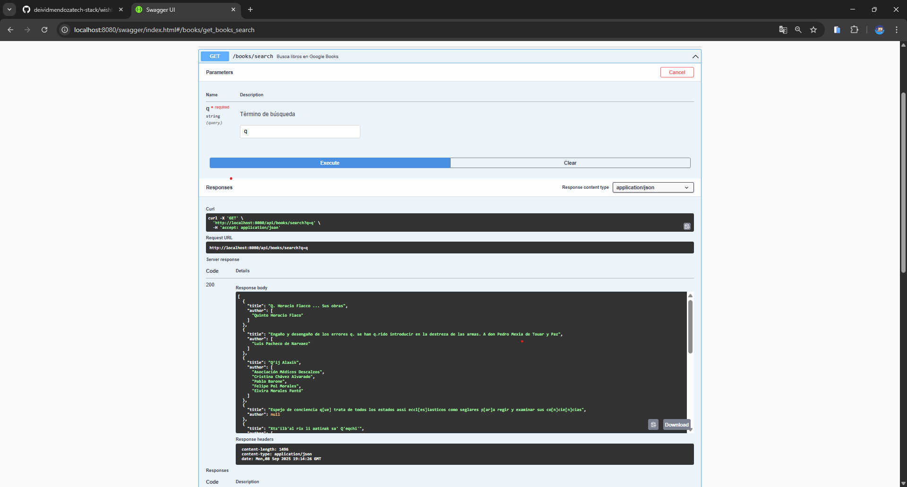

[](https://github.com/deividmendozatech-stack/wishlist/actions/workflows/ci.yml)

# 📚 Wishlist API

API REST escrita en **Go 1.25** para gestionar listas de deseos de libros.  
Incluye **SQLite + GORM** para persistencia, autenticación con **JWT** (en progreso), documentación con **Swagger** y **Dockerfile** para despliegue sencillo.

Repositorio: [https://github.com/deividmendozatech-stack/wishlist](https://github.com/deividmendozatech-stack/wishlist)

---

## 🚀 Ejecutar en local

```bash
# Clonar el repositorio
git clone https://github.com/deividmendozatech-stack/wishlist.git
cd wishlist

# Instalar dependencias
go mod tidy

# Ejecutar el servidor
go run cmd/server/main.go

Por defecto el servidor expone:
API: http://localhost:8080/api
Swagger UI: http://localhost:8080/swagger/index.html

🐳 Ejecutar con Docker:
docker build -t wishlist-api .
docker run -p 8080:8080 wishlist-api

📖 Documentación Swagger:
Una vez en ejecución, abre en el navegador:
http://localhost:8080/swagger/index.html

🔑 Endpoints principales:
| Método | Ruta                                | Descripción                   |
| ------ | ----------------------------------- | ----------------------------- |
| POST   | `/api/users/register`               | Registrar usuario             |
| POST   | `/api/wishlist`                     | Crear wishlist                |
| GET    | `/api/wishlist`                     | Listar wishlists del usuario  |
| DELETE | `/api/wishlist/{id}`                | Eliminar wishlist             |
| POST   | `/api/wishlist/{id}/books`          | Agregar libro a wishlist      |
| GET    | `/api/wishlist/{id}/books`          | Listar libros de wishlist     |
| DELETE | `/api/wishlist/{id}/books/{bookID}` | Eliminar libro                |
| GET    | `/api/books/search?q=<query>`       | Buscar libros en Google Books |


📦 Ejemplos de Requests y Responses:
| Operación         | Request (JSON)                                | Response (JSON)                               |
| ----------------- | --------------------------------------------- | --------------------------------------------- |
| Registrar usuario | `{ "username": "david", "password": "1234" }` | `201 Created`                                 |
| Crear wishlist    | `{ "name": "Libros pendientes" }`             | `201 Created`                                 |
| Listar wishlists  | *N/A* (GET)                                   | `[{"id":1,"name":"Libros pendientes"}]`       |
| Eliminar wishlist | *N/A* (DELETE)                                | `204 No Content`                              |
| Agregar libro     | `{ "title": "Go 101", "author": "Anon" }`     | `201 Created`                                 |
| Listar libros     | *N/A* (GET)                                   | `[{"id":1,"title":"Go 101","author":"Anon"}]` |
| Eliminar libro    | *N/A* (DELETE)                                | `204 No Content`                              |
| Operación          | Request (HTTP)                         | Response (JSON)                                             |
| ------------------ | --------------------------------------- | ----------------------------------------------------------- |
| Buscar libros (Google Books) | `GET /api/books/search?q=golang`           | `[{"title":"The Go Programming Language","author":["Alan Donovan","Brian Kernighan"]},{"title":"Go in Action","author":["William Kennedy"]}]` |


🧪 Ejecutar tests:
go test ./... -v
Tests unitarios incluidos para handlers, services y repositories con mocks simples.

📂 Estructura básica:
cmd/server         # main.go, punto de entrada
internal/domain    # modelos: User, Wishlist, Book
internal/handler   # HTTP handlers y rutas
internal/service   # lógica de negocio
internal/repository/gorm # repositorios con GORM
internal/platform/storage # conexión SQLite
pkg/auth           # helpers JWT (futuro)
docs               # archivos swagger

✅ CI/CD:
GitHub Actions ejecuta "go test ./..." en cada push a main.
Badge de estado visible arriba del README.

🔄 Guardar y subir cambios a GitHub:
# Ver qué archivos cambiaron
git status

# Añadir cambios al área de preparación
git add .

# Confirmar con un mensaje descriptivo
git commit -m "Descripción breve de los cambios"

# Subir a la rama principal en GitHub
git push origin main

🔎 Búsqueda de libros en Google Books:
La API permite consultar el catálogo público de Google Books y devolver resultados con título y autores.

📡 Endpoint
| Método | Ruta                | Descripción                       |
| ------ | ------------------- | --------------------------------- |
| GET    | `/api/books/search` | Buscar libros usando Google Books |

📥 Parámetros de consulta
| Nombre | Tipo   | Obligatorio | Descripción                                |
| ------ | ------ | ----------- | ------------------------------------------ |
| `q`    | string | Sí          | Término de búsqueda (por ejemplo `golang`) |

📤 Ejemplo de petición
curl "http://localhost:8080/api/books/search?q=golang"

📄 Respuesta (200)
[
  {
    "title": "The Go Programming Language",
    "author": ["Alan Donovan", "Brian Kernighan"]
  },
  {
    "title": "Go in Action",
    "author": ["William Kennedy"]
  }
]

❌ Errores
| Código | Mensaje                   | Motivo                                                 |
| ------ | ------------------------- | ------------------------------------------------------ |
| 400    | `"missing query param q"` | Falta el parámetro `q` en la consulta                  |
| 500    | `"error ..."`             | Fallo al conectar o procesar respuesta de Google Books |


📷 Vista en Swagger:
A continuación se muestra cómo se visualiza el endpoint **`/api/books/search`** en Swagger UI:



✍️ Autor
David Mendoza – @deividmendozatech-stack